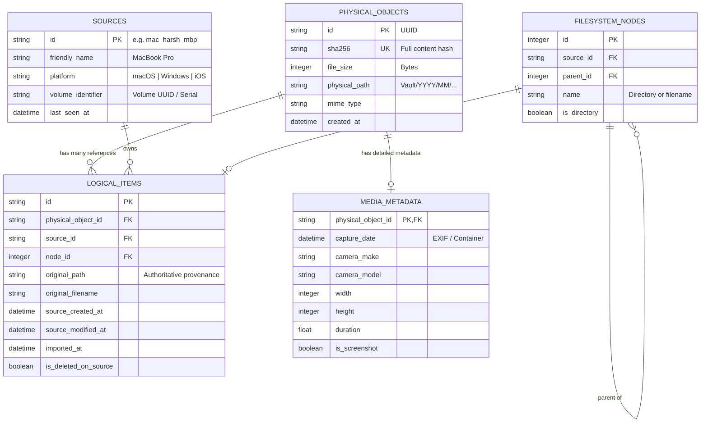

# 16 — Synaps NAS Architecture Audit & Engineering Critique

---

## Part 1: Detailed Codebase Audit (What Currently Exists)

An inspection of the existing codebase (`backend/`, `frontend/`, `mock_storage/`, `sync_iphone_to_nas.py`, `detect_origin.py`, and `docs/`) reveals the current operational state:

### 1. Current Architecture Overview
Synaps currently operates as a dual-tier hybrid application:
- **Frontend**: Next.js 14 App Router running with Tailwind CSS and Framer Motion. Uses Next.js API rewrites (`next.config.js`) to proxy `/api/:path*` to FastAPI on port 8000.
- **Backend**: Python FastAPI with SQLite (`synaps.db`) managed via SQLAlchemy.
- **Background Operations**: Background daemon threads for initial filesystem scanning (`scanner.py`), on-demand thumbnail generation (`thumbnails.py`), and import staging processing (`import_manager.py`).

```
┌────────────────────────────────────────────────────────┐
│               Frontend (Next.js 14)                    │
│   Timeline (/), Finder (/finder), Sync/Import (/sync)   │
└───────────────────────────┬────────────────────────────┘
                            │ Next.js Proxy Rewrite
                            ▼
┌────────────────────────────────────────────────────────┐
│               Backend (FastAPI :8000)                  │
│  /api/media  |  /api/finder  |  /api/import  |  /sync  │
└──────┬────────────────────┬────────────────────┬───────┘
       │                    │                    │
       ▼                    ▼                    ▼
┌──────────────┐    ┌──────────────┐    ┌─────────────────┐
│ SQLite DB    │    │ Worker Pool  │    │ Filesystem      │
│ (synaps.db)  │    │ Thumbnails   │    │ /storage/Vault/ │
└──────────────┘    └──────────────┘    └─────────────────┘
```

---

### 2. Existing Importer Architecture
The existing "Importer" is **not** a client running on devices. It is a **NAS-side staging folder processor**:
- **Source Location**: Hardcoded to `STORAGE_PATH/Imports/harsh/Iphone` (`config.py`).
- **Workflow**:
  1. `scan()`: Recursively walks the staging folder, counts images/videos and calculates total size without reading EXIF.
  2. `execute_preview()`: A background daemon thread reads EXIF/video headers using `get_best_date()` and projects destination directories (`YYYY/MM/`, `Old_Photos/`, or `Unknown_Date/`).
  3. `execute()`: Moves files via `shutil.move()` directly into `STORAGE_PATH/Vault/Harsh/Iphone/YYYY/MM/`.
  4. Triggers a full synchronous `scan_directory(db)` upon completion to index new files.
- **In-Memory Tracking**: Uses an in-memory `_JobStore` (`import_manager.py`) with a polling API (`GET /api/import/progress/{job_id}`).
- **Device Sync Script**: In addition to the backend, there is `sync_iphone_to_nas.py`, a standalone script on macOS that uses `ssh` and `rsync` to push files from `~/Documents/iphone` directly into the NAS at `/storage/Vault/Harsh/Iphone/`.

---

### 3. Existing Database Schema
The database (`backend/models.py`) consists of four tables:

```sql
-- Core indexed media
CREATE TABLE media_files (
    id VARCHAR PRIMARY KEY,                 -- UUIDv4
    filename VARCHAR NOT NULL,
    path VARCHAR NOT NULL UNIQUE,           -- Absolute NAS filesystem path (HARD CONSTRAINT)
    relative_path VARCHAR NOT NULL,
    directory VARCHAR NOT NULL,
    source VARCHAR,                         -- 'iphone', 'mac', 'windows' (derived from folder name)
    extension VARCHAR NOT NULL,
    mime_type VARCHAR,
    file_size INTEGER,
    width INTEGER, height INTEGER, duration FLOAT,
    media_type VARCHAR NOT NULL,            -- 'image', 'video', 'document'
    is_screenshot BOOLEAN, is_screen_recording BOOLEAN, is_raw BOOLEAN, is_favorite BOOLEAN,
    date_taken DATETIME, date_created DATETIME, date_modified DATETIME, date_indexed DATETIME,
    camera_make VARCHAR, camera_model VARCHAR, gps_lat FLOAT, gps_lon FLOAT,
    has_thumbnail BOOLEAN, thumbnail_path VARCHAR,
    file_hash VARCHAR,                      -- MD5 of first 64KB (fast partial hash)
    content_hash VARCHAR(64),               -- Full SHA-256
    hash_algorithm VARCHAR(16) DEFAULT 'sha256'
);

-- Staging & sync history
CREATE TABLE sync_records (
    id VARCHAR PRIMARY KEY,
    filename VARCHAR NOT NULL,
    file_hash VARCHAR NOT NULL,
    content_hash VARCHAR(64),
    hash_algorithm VARCHAR(16),
    file_size INTEGER,
    destination_path VARCHAR NOT NULL,
    synced_at DATETIME,
    source_device VARCHAR                   -- Default 'iPhone'
);

-- Trash management
CREATE TABLE trash_items (
    id VARCHAR PRIMARY KEY,
    original_path VARCHAR NOT NULL,
    trash_path VARCHAR NOT NULL,
    filename VARCHAR NOT NULL,
    file_size INTEGER,
    media_type VARCHAR,
    deleted_at DATETIME,
    auto_delete_at DATETIME
);

-- App settings (key/value)
CREATE TABLE settings (key VARCHAR PRIMARY KEY, value TEXT, updated_at DATETIME);
```

---

### 4. Existing Upload Flow
There are two HTTP upload endpoints in `backend/routers/sync.py`:
- `POST /api/sync/upload` (single file)
- `POST /api/sync/upload-batch` (multi-file)

**Upload Mechanics**:
1. Entire file is read into memory via FastAPI: `content = await file.read()`.
2. Computes MD5 of the content in memory: `hashlib.md5(content).hexdigest()`.
3. Checks for duplicates against `sync_records.file_hash` and `media_files.file_hash`.
4. If unique, writes the file to:
   `STORAGE_PATH/Vault/Harsh/Iphone/<Current_Year>/<Current_Month>/<filename>`
   *(Note: it uses `datetime.now()` for upload directory, not EXIF date!)*
5. Resolves filename collisions by appending sequential integers: `<name>_1.<ext>`, `<name>_2.<ext>`.
6. Inserts a `SyncRecord`.

---

### 5. Existing Storage Layout
Storage is physically partitioned by user, device, and date:
```
mock_storage/ (or /storage/ on NAS)
├── Imports/
│   ├── Harsh/
│   │   └── Iphone/          <-- Staging folder for import_manager.py
│   ├── Dad/
│   ├── Mom/
│   └── Sister/
└── Vault/
    ├── Harsh/
    │   ├── Iphone/
    │   │   ├── 2024/ ... 2026/05/
    │   │   ├── Old_Photos/
    │   │   └── AAE files/
    │   └── Mac/
    │       └── Private/     <-- Explicitly blacklisted in config.py
    ├── Dad/
    ├── Mom/
    ├── Sister/
    ├── Windows_laptop-HP/   <-- Blacklisted in config.py (likely SMB target)
    └── windows-pc/
```

---

### 6. Existing Metadata Handling
- **EXIF Extraction**: Uses `exifread` for JPEGs and `Pillow` + `pillow-heif` for HEIC files (`scanner.py`). Extracts `DateTimeOriginal`, `camera_make`, `camera_model`, and GPS coordinates.
- **Video Metadata**: Calls `ffprobe` via subprocess to extract `creation_time` from QuickTime/MP4 container atoms.
- **Filename Regex**: Falls back to parsing `YYYY-MM-DD` and `YYYYMMDD` patterns in filenames.
- **Filesystem Fallback**: Uses `st_birthtime` (creation date on macOS/APFS) > `st_mtime` > `st_ctime`.
- **Heuristic Provenance Script (`detect_origin.py`)**: A 559-line script that analyzes EXIF camera make/model, QuickTime atoms (`Core Media Video`, `Lavf`, `Adobe`, `iPhone`), and macOS `xattr` to guess whether a file came from Mac, iPhone, Windows, or a camera. **This validates the principle: attempting post-hoc heuristic guessing is brittle and produces false classifications.**

---

### 7. Existing Duplicate Handling
Synaps currently implements a **Two-Stage Content Deduplication**:
1. **Stage 1 (Fast filter)**: Checks file size in bytes against existing records in SQLite.
2. **Stage 2 (Exact confirmation)**: If file sizes match, computes the full SHA-256 (`content_hash`) of both files chunk-by-chunk (64 KB blocks).
3. **Action on Match**: The duplicate file in `Imports/` is skipped, logged in `job.error_log`, and **never imported or referenced**.

---

### 8. Existing Dashboard Browsing Architecture
- **Timeline (`/`) & Gallery**: Fully database-driven. Queries `media_files`, orders by `date_taken DESC`, groups by month/year, and serves paginated records (80 per page).
- **Finder (`/finder`)**: **Directly reads the physical disk.** In `routers/finder.py`, it executes `os.listdir()` and `os.stat()` synchronously on `STORAGE_PATH`. **It has no virtual filesystem capability whatsoever.**

---

### 9. What Can Be Reused
- **FastAPI Core & Router System**: The server lifecycle, routing, and Next.js proxy integration are solid.
- **Metadata Parsers (`scanner.py`)**: HEIC parsing (`pillow-heif`), video atom parsing (`ffprobe`), and EXIF extraction work reliably.
- **Thumbnail Engine (`thumbnails.py`)**: Asynchronous WebP generation with disk caching and single-thread queuing prevents memory thrashing on low-end CPUs.
- **Two-Stage Duplicate Detection Principle**: Grouping by `file_size` first before computing SHA-256 is the single most important performance safeguard on a spinning HDD.
- **Liquid Glass Frontend Components**: The UI design system (`GlassPanel`, `GlassButton`, viewer modals, media grid) is clean, responsive, and well-styled.

---

### 10. What Must Change
1. **Database Model**: `media_files.path` is currently `UNIQUE`. It cannot represent a file that exists at two different logical paths on different machines. We must decouple **Physical Stored Objects** from **Logical References/Provenance**.
2. **Finder Architecture**: `routers/finder.py` currently calls `os.listdir()`. To support a virtual hierarchy, it must be rewritten to query the database.
3. **Upload/Ingestion Pipeline**: The current `/api/sync/upload` dumps everything into `Vault/Harsh/Iphone/<Year>/<Month>/` and reads entire files into memory with `await file.read()`. This causes Out-Of-Memory (OOM) crashes on 2 GB RAM when uploading large 4K iPhone videos.
4. **Client-Side Discovery**: Replace the manual copy-to-staging approach with a lightweight client agent that scans local disk, tracks state, captures true acquisition path, and communicates with the NAS API.

---

### 11. Proposed Final Architecture Summary
```
                                CLIENTS
        [macOS Client]      [Windows Client]       [iPhone Client]
       (Local SQLite State) (Local SQLite State)   (PhotoKit Cursor)
              │                    │                       │
              └────────────────────┼───────────────────────┘
                                   │ HTTP/JSON API (Token Auth)
                                   ▼
                            SYNAPS NAS API
              ┌────────────────────────────────────────┐
              │ 1. Ingestion Endpoint                  │
              │    - Validates provenance payload      │
              │    - Checks SHA-256 deduplication      │
              │ 2. Streaming Chunk Receiver            │
              │    - Temp buffer on disk (not RAM)     │
              │    - Atomic rename to Canonical Vault  │
              │ 3. Relational Metadata Commit          │
              └────────────────────┬───────────────────┘
                                   │
                ┌──────────────────┴──────────────────┐
                ▼                                     ▼
        PHYSICAL STORAGE                       DATABASE (SQLite)
    /storage/Vault/YYYY/MM/              ┌─────────────────────────────┐
    └── <content_hash>.<ext>             │ physical_objects (1)        │
                                         │  └── logical_provenance (N) │
                                         │  └── media_metadata (1)     │
                                         └──────────────┬──────────────┘
                                                        │
                                                        ▼
                                              VIRTUAL BROWSER API
                                              - Reconstructs folders
                                              - Powers Web Dashboard
```

---

### 12. Risks and Conflicts Identified
1. **The 327+ GB Live Data Risk**: Existing files in `/storage/Vault` are actively indexed by `media_files` with hardcoded absolute paths. Any naive script that modifies the database schema or moves files will break the current timeline.
2. **OOM on Low RAM**: Reading entire uploads into RAM (`await file.read()`) will crash Python if someone uploads a 3 GB video on the 2 GB Pentium NAS.
3. **Samba / Windows Locks**: If Samba shares `Vault/Windows_laptop-HP` while Synaps reorganizes files into canonical storage, file locks and concurrent writes will cause corruption.
4. **Filesystem vs Virtual Desynchronization**: If a user uses Windows File Explorer to delete or move files on a Samba share, a database-driven virtual filesystem will become out of sync unless explicitly updated.

---

## Part 2: Critical Architecture Challenge & Technical Analysis

We critically stress-test the architecture against real-world engineering constraints, edge cases, and the specific hardware reality (Dual-Core Pentium / Core2Duo, 2 GB RAM, single spinning HDD).

---

### 1. Why Might This Architecture NOT Work Well?

#### A. The "Disappearing File" Illusion (Mental Model Mismatch)
Users expect a NAS to behave like a disk. If a user imports:
`E:\Himachal\2025\Trip\IMG001.jpg`
and Synaps physically places it at:
`/storage/Vault/2025/06/a8f9c2d...jpg`
and the user mounts the NAS via SMB on their Mac or Windows PC, **`E:\Himachal` does not exist on the NAS disk.**
When the user opens Finder or File Explorer over SMB, they will only see `Vault/2025/06/`. To find their file by original path, they are **forced to open the Synaps Web UI**. For a personal NAS, this creates friction.

#### B. The Unidirectional Sync Trap
If a user deletes `IMG001.jpg` on their Windows laptop to free up space, what happens on the NAS?
- Does the NAS delete the logical reference?
- Does the NAS retain it as a backup?
- If the NAS retains it, the importer on the next "Check for Changes" will see that the file is missing locally. If it treats this as a deletion, it wipes the record. If it doesn't, it is not a sync tool; it is an append-only archive.
**Distinction**: Synaps is fundamentally an **Append-Only Digital Archive with Provenance**, not a 2-way sync engine like Dropbox. Local deletions should NOT delete data from the NAS.

#### C. Database Dependency as Single Point of Failure (SPOF)
If `synaps.db` gets corrupted (power outage on the old PC, bad sectors on the single HDD), **the entire logical directory structure is erased.** On the disk, all you have left is:
`/storage/Vault/2025/06/3f7a1b...jpg`
Without the database, you cannot know which photos were from the Himachal trip, which were from Mac downloads, or which belonged to which person.

---

### 2. Technical Limitations & Edge Cases Overlooked

1. **Path Separator & Encoding Incompatibilities**:
   - Windows uses backslashes (`\`) and case-insensitive NTFS paths.
   - macOS uses forward slashes (`/`), UTF-8 NFD (decomposed Unicode).
   - Linux uses forward slashes (`/`), UTF-8 NFC (precomposed Unicode).
   - If Windows sends `E:\Photos\Café.jpg` and Mac sends `/Users/.../Photos/Café.jpg`, string comparisons in SQLite will fail to detect identical paths or duplicates unless strict Unicode normalization (`unicodedata.normalize('NFC')`) and path sanitization are applied before DB storage.
2. **Drive Letter Instability on Windows**:
   - Windows drive letters are not persistent identities. If an external hard drive mounts as `E:` today and `F:` tomorrow, naive path matching thinks all files were deleted from `E:` and added to `F:`.
   - **Fix**: The client must bind to the **Volume GUID / Volume Serial Number**, not the transient drive letter.
3. **Mac Inode Churn & APFS Clones**:
   - On macOS, saving an edit in Preview or Photoshop writes a new file to a temporary name and renames it over the original. This changes the inode and modification timestamp, even if the content is identical.
4. **App-Managed Files (Apple Photos & Lightroom Libraries)**:
   - If a Mac user selects `~/Pictures/Photos Library.photoslibrary`, they are importing an internal, mutating SQLite/package database. Attempting to scan and import raw paths inside packages leads to broken derivative imports.
5. **Zero-Byte and Corrupted Files**:
   - Camera cards frequently have 0-byte `.DAT` files or partially written `.MP4` files. Hashing them yields known empty hashes (`e3b0c44298fc1c149afbf4c8996fb92427ae41e4649b934ca495991b7852b855`). All 0-byte files across all computers would collapse into a single physical file if not protected.

---

### 3. Is There a Fundamentally Better Architecture for Achieving the Same Goal?

Yes: A **Dual-Layer Hardlink / Reflink Hybrid Architecture**:
Instead of making the physical filesystem an opaque content store that requires the web database to browse:
1. Store files physically in their canonical location:
   `/storage/Vault/YYYY/MM/<hash>.jpg`
2. Maintain **hardlinks** on the NAS disk so that the NAS filesystem mirrors the original directory tree:
   `/storage/Reconstructed/Windows-Laptop/E/Himachal/2025/IMG001.jpg` (Hardlink pointing to the same inode!)

**Why this is superior**:
- **Zero extra disk space**: A hardlink takes zero additional bytes of storage.
- **Samba / Finder / Explorer compatibility**: You can share `/storage/Reconstructed/` over Samba, and Windows Explorer / Mac Finder browse the original folder tree at full native speed.
- **Disaster Survival**: If SQLite dies, your directory structure still exists on disk.

---

### 4. Better Way to Preserve Original Folder Hierarchy Without Sacrificing NAS Performance

The proposed approach uses database recursive queries or path string splitting to reconstruct the hierarchy on the fly.
**The Performance Bottleneck**: Querying `WHERE original_path LIKE 'E:\Himachal\%'` across 100,000 files in SQLite on a spinning HDD with 2 GB RAM causes severe disk head thrashing.

**The Solution: Adjacency List / Materialized Node Table**:
```sql
CREATE TABLE filesystem_nodes (
    node_id INTEGER PRIMARY KEY AUTOINCREMENT,
    source_id VARCHAR NOT NULL,
    parent_node_id INTEGER REFERENCES filesystem_nodes(node_id),
    name VARCHAR NOT NULL,
    is_directory BOOLEAN NOT NULL,
    physical_object_id VARCHAR REFERENCES physical_objects(id),
    UNIQUE(source_id, parent_node_id, name)
);
CREATE INDEX idx_nodes_parent ON filesystem_nodes(source_id, parent_node_id);
```
To list the contents of `E:\Himachal`:
`SELECT * FROM filesystem_nodes WHERE parent_node_id = 492;`
This is an exact-match index seek. It returns in **0.2 milliseconds** on an ancient Pentium CPU without touching disk I/O.

---

### 5. Can Mac Finder and Windows File Explorer Interact Naturally with the Virtual Filesystem?

| Integration Method | Viability on Old Pentium NAS | User Experience | Verdict |
|---|---|---|---|
| **Samba (SMB) over FUSE** | **Extremely Poor** | Python FUSE querying SQLite on every `readdir` will cause Explorer/Finder beachballs and timeouts. | **Do NOT Attempt** |
| **WebDAV Server** | **Moderate** | Windows WebDAV has a 50 MB default file limit and unstable video streaming. | **Risky** |
| **Hardlink Mirror Tree on Disk + Standard Samba Share** | **Excellent** | Synaps maintains real filesystem hardlinks inside `/storage/Mirrors/<Device>/...`. Native Linux Samba serves it at full wire speed. | **Recommended** |
| **Synaps Web Interface Only** | **Guaranteed Stability** | Primary modern interface for browsing virtual structures. | **Primary Target** |

---

### 6. Are There Problems with Using a Database as the Source of Truth for Filesystem Structure?

1. **The Orphaned File Dilemma**: If physical files exist on disk but DB records are lost, data is orphaned.
2. **Crash Consistency / Split-Brain**: Power loss between file transfer and DB commit causes ghost files. Mitigated with SQLite WAL mode and atomic two-phase staging journals.
3. **Backup & Disaster Recovery**: Backing up `/storage/Vault` without `synaps.db` is useless. Both must be backed up together.

---

### 7. What Problems Occur with Renamed, Moved, Deleted, or Modified Files on Source Devices?

- **Modified (Same path, new content)**: Generates a new SHA-256. Synaps stores the new physical object and updates the logical item pointer. The old physical object remains in the vault if referenced by another device or version history.
- **Renamed / Moved (Same content, new path)**: Hash matches existing physical object. No network transfer is required (instant metadata update). The client importer tracks local inode/file identity in `.synaps-client.db` so it knows this was a move, not a delete + new file.
- **Deleted on Source**: Marked as `exists_on_source = FALSE`. The file is retained in Synaps archive; it is not deleted from the NAS.

---

### 8. What Problems Occur with Deduplication When the Same File Exists at Multiple Original Paths?

- **The Golden Architectural Rule**:
  **Physical Objects must be completely immutable and anonymous.**
  A physical object has ONLY: `id`, `sha256`, `size_bytes`, `physical_path`, `created_at`.
  It has NO filename, NO source device, NO folder path, and NO user metadata.
  All filenames, folder hierarchies, and source attributes belong exclusively in `logical_records` linking to the physical object.

---

### 9. What Limitations Will iOS Impose on the Importer Concept?

- **No Raw Filesystem Access**: iOS apps cannot browse directories. Media is accessed via `PhotoKit` (`PHPhotoLibrary`).
- **No Native File Paths**: iOS provides opaque `localIdentifier` strings, not paths like `/DCIM/100APPLE/`.
- **Background Execution Limits**: iOS freezes background apps after ~30 seconds. Large library syncs must run in the foreground or use background URLSession tasks.
- **Solution**: Represent iOS provenance as `source_location = "Camera Roll"`. Track assets via persistent `localIdentifier`.

---

### 10. Physical Storage: Vault/YYYY/MM vs Content-Addressed Storage (CAS) vs Hybrid

- **Hybrid Canonical Date-CAS (Recommended)**:
  `/storage/Vault/<Year>/<Month>/<sha256[:16]>_<original_name>`
  - Retains human readability on disk for emergency recovery.
  - 16-character content hash prefix guarantees 100% collision-free uniqueness.

---

### 11. Hardware Reality Check: Old Pentium / Core2Duo, 2 GB RAM, Single HDD

A single spinning hard drive handles only **75–100 random IOPS**. Heavy random I/O drops throughput to <1 MB/s.

#### Strict Performance Directives:
1. **Client-Mandated Hashing**: The client machine (Mac/Windows) computes SHA-256 before streaming. The NAS verifies it on-the-fly during write. The NAS never re-reads files from disk to hash them.
2. **Batch & Defer Thumbnails**: Never generate thumbnails during import. Queue for background processing or on-demand browsing.
3. **SQLite PRAGMAs**: WAL mode, 32 MB page cache, in-memory temp store, 128 MB mmap.
4. **Zero-Copy Streaming**: Avoid `await file.read()`. Stream chunked 256 KB buffers directly to disk.

---

## Part 3: Architecture Comparison

| Dimension | Proposed Architecture | Recommended Production Architecture | Rationale & Trade-off |
|---|---|---|---|
| **Storage Naming** | `/Vault/YYYY/MM/<file-id>.<ext>` | `/Vault/YYYY/MM/<sha256[:12]>_<safe_name>.<ext>` | Preserves human readability while guaranteeing collision-free uniqueness. |
| **Deduplication Model** | 1 Physical Object, N DB Paths (Virtual only) | 1 Physical Object, N DB Paths + **Optional Hardlink Projection** | Adding filesystem hardlinks allows users to browse original folder structures over SMB. |
| **Client Hashing** | Hash calculated during import on NAS or client | **Client-Mandated Hashing** | Shifts CPU load and disk read I/O from the weak Pentium NAS to powerful client machines. |
| **Folder Hierarchy Storage** | Parsing raw path strings dynamically in SQLite | **Adjacency Table / Node Tree (`filesystem_nodes`)** | Reconstructing nested directories via `parent_id` is an $O(1)$ index seek. |
| **Client Change Detection** | Generic scan for changes | **Client-Side SQLite Cache (`.synaps-cache.db`)** | Client checks `(mtime, size, inode)`. Never recalculates hashes on untouched files. |
| **iPhone Strategy** | Same protocol as desktop | **PhotoKit Cursor Sync Protocol** | Accommodates iOS background execution limits and lack of filesystem access. |
| **Import Safety** | Two-stage check + move | **Atomic 2-Phase Staging (`.synaps-tmp` → Vault)** | Prevents half-uploaded files from corrupting the canonical vault. |

---

## Part 4: Recommended Target Data Model (Production-Grade)



---

## Part 5: Phased Implementation Roadmap

```
Phase 1: Ingestion Protocol & Database Extension (Non-Destructive)
├── Deploy relational tables (`physical_objects`, `logical_items`, `sources`, `filesystem_nodes`)
├── Build streaming chunked API: `/api/v2/ingest`
└── Verify with small test dataset in isolated `/mock_storage/TestVault/`

Phase 2: Cross-Platform Desktop Importer CLI / Agent
├── Lightweight Python client for macOS and Windows
├── Change detection using local `(mtime, size)` index
├── "Check for Changes" with diff review and selective import
└── Pre-hash SHA-256 on client, stream to `/api/v2/ingest`

Phase 3: Virtual Filesystem UI in Synaps Dashboard
├── Add "Sources" browser to Dashboard sidebar: Mac / Windows / iPhone
├── Tree navigation powered by `filesystem_nodes`
└── Full integration with existing Media Viewer & Transcoder

Phase 4: Controlled Migration Tooling (Only After User Approval)
├── Non-destructive indexer for existing 327+ GB library
└── Generates dry-run migration plan report without altering disk files
```
